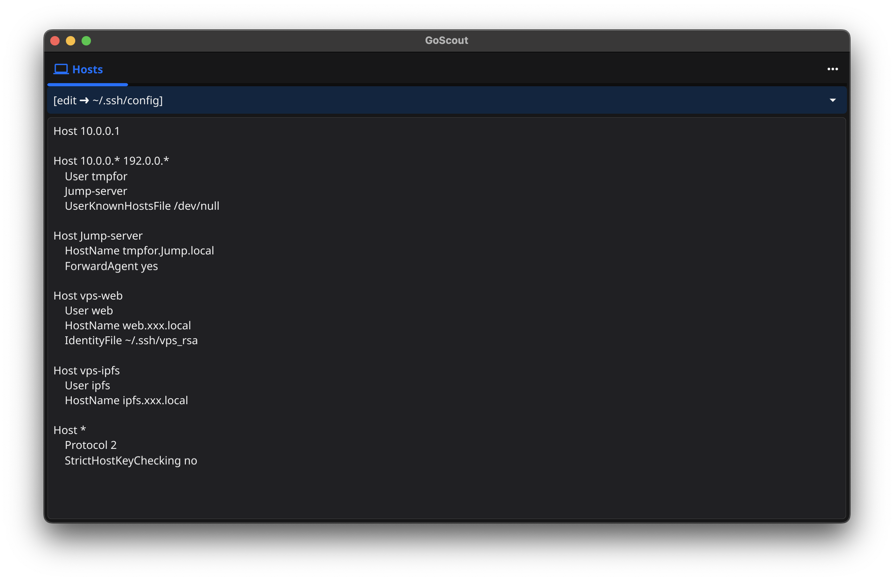
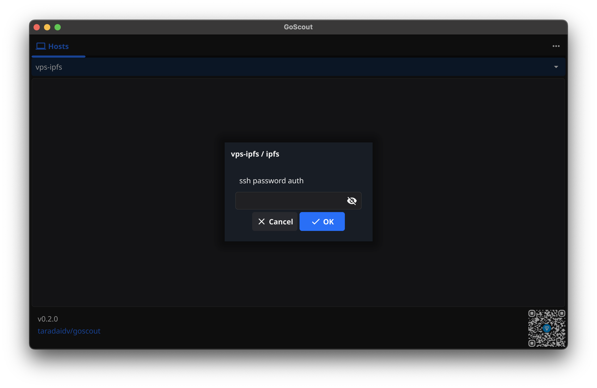

<div align="center">

[TXH / ACKNOWLEDGEMENTS](./CREDITS.md)
</div><p align="center"></p>

# GoScout

The GoScout is a UI tool for efficient and secure remote host management using ssh. It's fully written in Go and requires no additional software installations.


[](https://golang.org)
[](https://t.me/taradaidv)
[](https://apps.fyne.io)
[](https://golang.org)
[](https://github.com/taradaidv/goscout/tree/main)





## Features
- **Go**: Fully written in Go, ensuring high performance, reliability, and cross-platform compatibility.
- **Hotkeys**: Text tweaked in the SSH config and file editor gets saved with the hotkeys CMD+S or CTRL+S.
- **Jump Hosts**: Supports connections through jump hosts for more complex network setups.
- **Minimalism**: Lightweight and fast to use, without unnecessary bloat.
- **Remembers state**: Keeps track of window size and last active tabs so you can continue working in your familiar environment.
- **Security**: Uses SSH and SFTP with private keys for secure and reliable connections.
- **Tabs**: Supports multiple tabs, allowing you to manage several sessions or files simultaneously.
- **Themes**: Adaptive for light and dark OS themes
- **UI**: [Fyne.io](https://fyne.io) toolkit is being used.
- **WebDAV**: File syncing via WebDAV with a temporary in-memory file system

## Persistent installation 
Means the setup remains intact even after system reboots.

install in ~/go/bin and run
```
git clone https://github.com/taradaidv/goscout.git
cd goscout && go install . && goscout
```

or from [apps.fyne.io](https://apps.fyne.io/apps/com.github.taradaidv.goscout.html) Gallery
```
go install fyne.io/fyne/v2/cmd/fyne@latest
fyne get github.com/taradaidv/goscout
```
## TODO
There are lots of great things that could be added to this app.
Already planned is:

*Legend*  
⭕️ *abandoned*  
🟢 *implemented*  
⚪️ *developing* 

|**Planned Feature**| **Progress**|
|-|-|
|Add Kubernetes support|-|
|Add support for detection of the host list on Windows|-|
|Connection process output in the app window|🟢|
|Follow symlinks|🟢|
|Integrate with IPFS|-|
|Mouse actions|🟢|
|Password input support for *ssh* and *sftp*|🟢|
|Scroll-back|⚪️|
|Sync files and folders through the native OS file manager via WebDAV|⚪️|
|...|...|


## Support the project
This small utility is just the beginning of a larger project, and we need your help to maintain and expand the entire infrastructure. Join us in building something great!

## Why does the project need donations?
- **Infrastructure**: A stable and secure site with **HTTPS** is essential for building user trust. This also paves the way for integration with **IPFS**, ensuring decentralized data storage.
- **Documentation**: Creating detailed guides and tutorials is crucial so users can easily understand and effectively use the project.
- **Security**: Regular testing and auditing within the **CI/CD** process will help identify and fix vulnerabilities during the build phase, ensuring reliability and security for all users.
- **Community**: Supporting users and fostering an active community will make the project more dynamic and in demand, encouraging the exchange of experiences and ideas.
- **Motivation**: Recognizing contributions to the community inspires new achievements and maintains enthusiasm for ongoing project development.

You can support the project by donating, contributing code, improving documentation, or discussing issues.

## Donation Wallet Addresses

**TON:**
```
UQBesxeEBa8_xrwU8F_e-g49Cf5Hwf8Al5v0VXcDxU9hoUgM
```

**BTC:**
```
15WrGGwGGgDTe3iBQWvZcuFu6ZNQC9ePjU
```