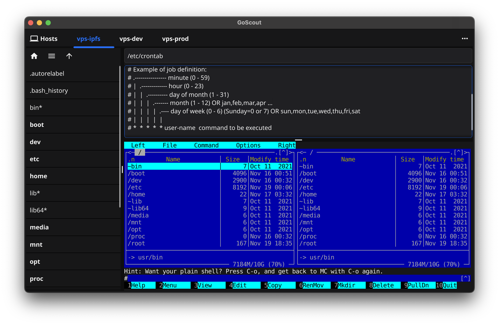

<p align="center">
  
</p>

# GoScout

GoScout is a tool with a UI for efficient and secure remote host management using key-based authentication. It's fully written in Go and requires no additional software installation.


[](https://golang.org)
[](https://t.me/taradaidv)
[](https://golang.org)
[](https://github.com/taradaidv/goscout/tree/main)
## Features

- **Security**: Utilizes SSH and exclusively certificates for reliable and secure connections.
- **Jump Hosts**: Supports connections through jump hosts for more complex network setups.
- **Minimalism**: Lightweight and fast to use, without unnecessary bloat.
- **Remembers state**: Keeps track of window size and last active tabs so you can continue working in your familiar environment.
- **UI**: [Fyne.io](https://fyne.io) UI toolkit is being used.
- **Hotkeys**: Text tweaked in the SSH config and file editor gets saved with the hotkeys CMD+S or CTRL+S.
- **Tabs**: Supports multiple tabs, allowing you to manage several sessions or files simultaneously.
- **Go**: Fully written in Go, ensuring high performance, reliability, and cross-platform compatibility.

<p align="center">
  
</p>

# Build and Run

```
git clone https://github.com/taradaidv/goscout.git
cd goscout ; go build -o goscout cmd/goscout.go
./goscout
```

# TODO
There are lots of great things that could be added to this app.
Already planned is:

* Scroll-back
* Mouse actions
* Follow symlinks
* And ...

---
This small utility is just the beginning of a larger project, and we need your help to maintain and expand the entire infrastructure. Join us in building something great!

<p align="center">
  

  [TON Wallet:](https://ton.org)UQDqFCrP01iTMfSFBHXFC-Q6S3CfsrCunVBy7DxWPYcxMsND
</p>

